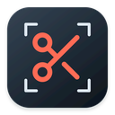
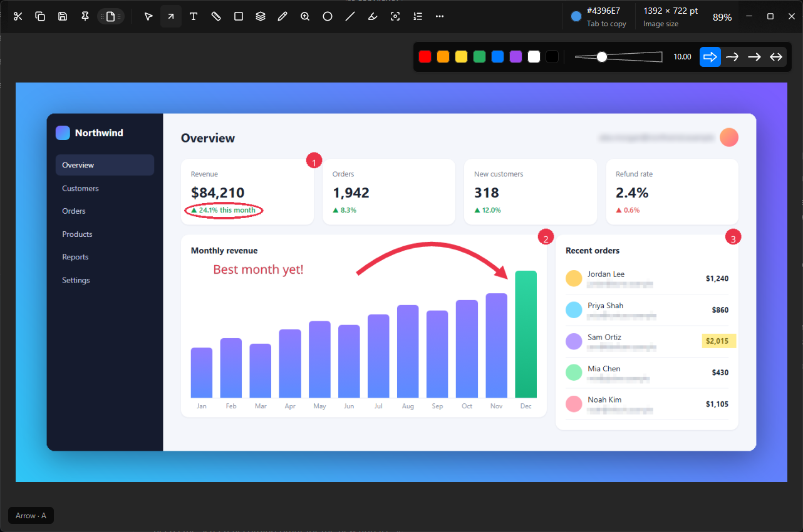
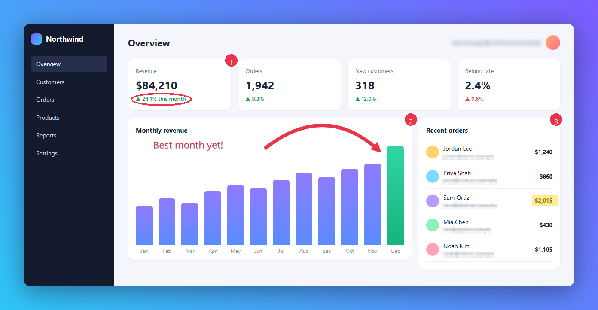
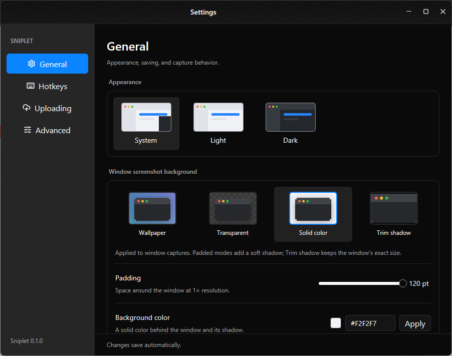

<div align="center">



# Sniplet

**Capture. Annotate. Copy.**

A fast, native screenshot tool for Windows, macOS, and Linux, written in Rust.

[](https://github.com/m4tta/sniplet/actions/workflows/ci.yml)
[](LICENSE)


<br>



</div>

<br>

## What it does

Press a shortcut and drag across your screen. The capture opens in the editor,
where you can mark it up and then copy, save, pin, or upload it.

| Feature        | What you can do                                                                       |
| -------------- | ------------------------------------------------------------------------------------- |
| **Capture**    | Area, full screen, a single window, scrolling pages, or the last area again           |
| **Annotate**   | Arrows, text, shapes, numbered steps, highlights, spotlight, magnifier, and freehand  |
| **Hide**       | Blur or pixelate emails, names, and anything else you don't want to share             |
| **Measure**    | Hold <kbd>1</kbd> or <kbd>2</kbd> to measure widths and heights in pixels or points   |
| **Recognize**  | Copy text out of an image with OCR, or decode a QR code                               |
| **Share**      | Copy to the clipboard, save as PNG, JPEG, or WebP, drag into another app, or upload   |
| **Keep**       | Save an editable `.sniplet` project and continue editing it later                     |

## How it works

<div align="center">

<br>
<sub>The exported image: a gradient backdrop, an arrow, numbered steps, a highlight, and pixelated emails.</sub>
</div>

<br>

1. **Capture.** Sniplet runs in the system tray (or the macOS menu bar) and
   listens for global shortcuts. Capturing freezes the screen, so you can choose
   exactly what you want before anything is saved.
2. **Edit.** Every annotation stays editable. Move, resize, restyle, or delete it
   at any point, and undo or redo as many steps as you like. The original pixels
   are never changed until you export.
3. **Share.** Sniplet renders your edits into a single image. Use the whole
   canvas or just a selection, and optionally add a padded backdrop with a shadow.

### Default shortcuts

| Action                      | Shortcut                                      |
| --------------------------- | --------------------------------------------- |
| Capture an area             | <kbd>Ctrl/Cmd</kbd> + <kbd>Shift</kbd> + <kbd>2</kbd> |
| Capture the screen          | <kbd>Ctrl/Cmd</kbd> + <kbd>Shift</kbd> + <kbd>1</kbd> |
| Capture a window            | <kbd>Ctrl/Cmd</kbd> + <kbd>Shift</kbd> + <kbd>3</kbd> |
| Scrolling capture           | <kbd>Ctrl/Cmd</kbd> + <kbd>Shift</kbd> + <kbd>4</kbd> |
| Recognize text or a QR code | <kbd>Ctrl/Cmd</kbd> + <kbd>Shift</kbd> + <kbd>7</kbd> |
| Reopen the editor           | <kbd>Ctrl/Cmd</kbd> + <kbd>Shift</kbd> + <kbd>8</kbd> |

You can change any of these in **Settings → Hotkeys**.

<div align="center">

</div>

### Under the hood

Sniplet is a Cargo workspace with three crates:

- **`sniplet-core`** holds the document model, annotations, measurement, and
  the renderer. It has no UI or OS dependencies, so it is fully unit-tested.
- **`sniplet-platform`** handles screen capture, the clipboard, OCR, QR
  decoding, settings, and uploads for each operating system.
- **`sniplet-app`** is the desktop app, built with
  [GPUI](https://github.com/zed-industries/zed/tree/main/crates/gpui) (the UI
  framework behind the Zed editor) and
  [gpui-kit](https://github.com/longbridge/gpui-kit).

## Run it locally

Install [stable Rust](https://rustup.rs), then clone and run:

```sh
git clone https://github.com/m4tta/sniplet.git
cd sniplet
cargo run --release -p sniplet-app
```

To try the editor without capturing anything, open the built-in sample or any
image:

```sh
cargo run --release -p sniplet-app -- --demo
cargo run --release -p sniplet-app -- path/to/image.png
```

Each platform also needs some native tools:

- **Windows:** Visual Studio 2022 Build Tools with *Desktop development with C++*.
- **macOS:** Xcode with the Metal toolchain. Grant Screen Recording permission
  when asked.
- **Linux:** a Vulkan-capable GPU, plus the development packages listed in the
  [guide](docs/guide.md#native-prerequisites).

Use `--release` for everyday use. Debug builds work, but they render large
images noticeably slower.

## Learn more

- [User and developer guide](docs/guide.md): every tool and setting, uploads,
  packaging, and verification
- [Feature checklist](docs/parity.md): what's implemented and what's still open
- [Platform testing](docs/platform-testing.md): results from real machines
- [Releases](docs/releases.md): how nightly and stable builds are made

Sniplet is in active development. Some features are still incomplete, and not
every platform has been fully tested yet.

## License

[Apache 2.0](LICENSE). The bundled Noto Sans font is under the
[SIL Open Font License](assets/fonts/OFL.txt), and the scissors icon comes from
[Lucide](assets/icons/LICENSE-LUCIDE).
